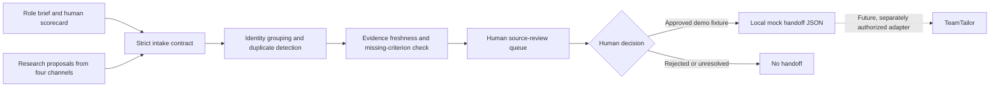

# Talent Research Handoff — interview prototype

[Читати українською](README.uk.md)

A small, runnable sketch for a recruiting team's **research → human review → approved handoff**. It is tailored to the public [A-Players Talent Engineer brief](https://aplayers.na.teamtailor.com/jobs/617015-talent-engineer-ai-automation-a-players), but is independent, unaffiliated, and uses only synthetic data.

The design question is narrow: **How can research from several sourcing hypotheses arrive as one traceable review queue, without silently turning an AI suggestion into a candidate decision or an ATS write?**

## Run in one minute

Python 3.11+; standard library only.

```bash
python3 run_demo.py
python3 -m unittest discover -s tests -v
python3 stress.py
```

`run_demo.py` writes `out/review_queue.json` and `out/mock_approved_handoff.json`. The example has six synthetic findings across four research channels, five unique people, one cross-channel duplicate, two incomplete or stale profiles, and three profiles ready for **human source checking**. One synthetic human approval produces one local mock handoff. No candidate is contacted or hired by this program.

## The five-minute architecture



The research proposal is untrusted input. The code checks shape, unknown criteria, record duplication, identity conflicts, and evidence dates. A source reference and snippet make a claim **inspectable**, not verified. A person must inspect the underlying source and decide whether the person is worth further work. The final TeamTailor arrow is deliberately **unimplemented**.

## Why this slice

The [role brief](https://aplayers.na.teamtailor.com/jobs/617015-talent-engineer-ai-automation-a-players) asks for parallel sourcing hypotheses, TeamTailor as one source of truth, and human ownership of candidate contact and hiring. A [public Talent Partner description](https://www.linkedin.com/posts/activity-7483505890185244673-QmZn) already describes AI-assisted research, scorecards, calibration, and source verification. This prototype therefore concentrates on the **handoff between useful research and a shared operating system**. That handoff is a design hypothesis to validate with the team, not a claim about A-Players' private workflow.

## Example output

```json
{
  "input_findings": 6,
  "unique_people": 5,
  "duplicate_findings_collapsed": 1,
  "ready_for_human_source_check": 3,
  "needs_more_evidence": 2,
  "identity_conflicts": 0
}
```

Inspect the checked-in [review queue](examples/review_queue.json) and [mock approved handoff](examples/mock_approved_handoff.json) without running code. The test suite includes stale evidence, a cross-channel duplicate, an identity collision, an unknown criterion, and an attempted approval of an incomplete profile.

## What I would validate with A-Players first

1. Where does research currently lose time: finding people, checking claims, avoiding duplicates, or entering complete records into TeamTailor?
2. Which scorecard fields and source types do Talent Partners already trust?
3. Who owns identity matching, TeamTailor fields, permissions, and source retention?
4. What is the baseline for time to first **qualified** candidate and Talent Partner acceptance rate?

Only after shadowing a live search would I adapt this contract to real data and propose a controlled integration. The first 2–3 weeks in the [job description](https://aplayers.na.teamtailor.com/jobs/617015-talent-engineer-ai-automation-a-players) are explicitly for shadowing before changes.

## Evidence and limits

- **Implemented:** deterministic local intake, grouping, evidence-status queue, mock human-gated export.
- **Verified locally:** focused tests and 200-repeat deterministic stress command.
- **Not implemented:** web sourcing, semantic AI ranking, real identity resolution, source fetching, candidate consent, TeamTailor API, analytics baseline, production security, or measured recruiting improvement.
- **No external effects:** no network, model, email, ATS write, or candidate communication.

See [architecture](docs/architecture.md) and [limits](docs/limits.md). This prototype was developed with AI coding assistance; its value is the reviewable problem framing, inspectable behavior, and explicit boundary, not a claim of hand-written code or recruiting deployment.
