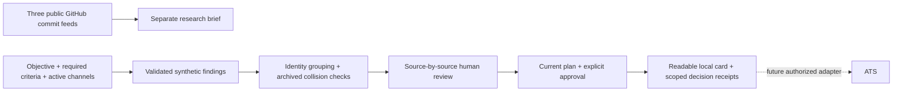

# Signal Desk

### Evidence first. Then a decision.

An interactive prototype with two distinct paths: a bounded public GitHub research and human follow-up loop, and a fictional manual review workflow that ends in a readable local handoff card.

**[Open the published version →](https://diadkoshmek.github.io/talent-research-workflow-prototype/?lang=en&showcase=1)** · **[Українською →](https://diadkoshmek.github.io/talent-research-workflow-prototype/?lang=uk&showcase=1)** · [Architecture](docs/architecture.md) · [Limits](docs/limits.md)


*v0.10.0 screenshot using a release-bundled actual public API capture. It contains no recruiter assessments. [Verification record](docs/verification.md).*

## Meeting path: role → source → human decision

[Open the recorded pass](https://diadkoshmek.github.io/talent-research-workflow-prototype/?lang=en&showcase=1). **Meeting fallback:** [save the standalone offline brief](docs/meeting-brief.en.html) ahead of time. It contains the same public metadata and two PR file summaries without JavaScript or live search. The release bundles one **actual public GitHub API capture from 28 September 2026**: five search lanes, eight numeric GitHub account IDs and 14 linked PRs. Two Remotion PRs for one ID include archived changed-file summaries, with diff text removed. It is an archival source signal, not current GitHub state or eight qualified people. No human assessment is prefilled.

The app reads the bundle from its own site without a GitHub request and checks its bytes against a SHA-256 pinned in the release. This detects file drift; it does not authenticate GitHub claims, personal authorship or work quality. A reviewer can inspect exact PR links, record a reasoned source decision and export a selected **further-research** card. A separate live-search button makes fresh public API calls. Partial or rate-limited live results are staged separately so the recorded pass and its human decisions remain visible until explicit replacement. There is no TeamTailor or Brain connection, measured recruiter benefit or qualified-candidate claim.

## A bounded public research pass

For the [Poolday Senior Agentic Software Engineer role](https://aplayers.na.teamtailor.com/jobs/536324-senior-agentic-software-engineer-poolday), **Run live search** makes five sequential public GitHub searches: video timelines in `remotion-dev/remotion` first, then agent orchestration in `langchain-ai/langgraphjs`, TypeScript tools in `vercel/ai`, programmable editors in `tldraw/tldraw`, and agent recovery in `triggerdotdev/trigger.dev`. Each exact query and its scanned, skipped, malformed and incomplete counts remain visible. The collector keeps PRs merged within 180 days with technical titles and public `User` authors, at most two distinct account IDs and two PRs per ID in each lane, up to ten IDs overall. It stops remaining requests on HTTP 403/429. A second button retains the earlier three-repository recent-commit pass for comparison.

The real-source loop reads an exact public PR and its files on a second explicit click, or an exact commit in the comparison mode. It shows bounded file and diff excerpts next to the review. A GitHub ID conflict is recorded, withdraws an earlier handoff, and blocks a positive assessment of that signal. A matching ID does not establish individual contribution. The human records a reasoned relevance/irrelevance/uncertainty decision and explicitly chooses an account for **further research only**. A source decision change withdraws the previous follow-up choice. A full report-and-action file can be restored; a smaller script-free card carries only selected source links, reasons and open questions. Diff excerpts stay in the tab and are not copied into the card. The research review is not autosaved, so save its file before leaving the page.

The separate **“Did this help a person?”** panel snapshots selected signals and accepts a local outcome and manually entered review minutes for each account. Its JSON can be saved and restored. It starts empty; entered outcomes and assessor labels are unauthenticated assertions. Recruiter feedback and a comparable baseline are still needed before claiming benefit.

A new live run also retains canonical PRs rejected by title screening from the already fetched rows: exact link, title, merge date and reason. They appear in a separate expandable lane list, not as leads or automatic follow-up. The concrete counterexample `fix: timeline frame alignment during trim` remains visible as excluded by the special Remotion title-prefix rule. Older saved runs, including the release-bundled archive, cannot reconstruct individual skipped rows that they never stored. Some skips lack a safe canonical row and remain count-only. This makes filter loss inspectable without another API request.

These are **five seeded repositories on one platform**, not a whole-market search. The collector examines only the first 20 results per query. Two PRs for one ID show repeated account activity, not two people. A technical PR title is a weak signal, and GitHub's `User` type is not proof of an independent human. A merged PR does not prove personal contribution, professional tenure, location, availability, interest or role fit. There is no candidate ranking. The standalone research brief and JSON can be downloaded; a saved JSON report can be reopened with its origin explicitly unverified. This research report never enters the fictional manual queue or approved handoff packet. Live collection needs the public GitHub API and may hit its unauthenticated rate limit. It needs no key or login.

## A walkthrough that explains itself

Choose **Watch the guided example** for five steps: task, insufficient evidence, a supporting source, a readable packet, and approval withdrawal. Each step explains the consequence. Scripted decisions are explicitly attributed to automated replay on fictional data, through the same engine; the separate manual queue is untouched. Save the walkthrough as a script-free offline reading copy. `?lang=en&demo=1` opens it immediately.

Recorded manual decisions and the plan are saved in this browser when local storage is available, then restored through engine replay. Unsubmitted input drafts are not saved. The UI reports storage failures or observed other-tab changes. **Save session file / Restore session file** provide a full local project-and-action backup, distinct from the recipient handoff. A session file is self-attested, not an authenticated audit. Multi-tab collaborative editing is not supported.

## Try to change its mind

The sample has **8 observations, 6 fictional people, 4 research hypotheses and 1 identity conflict**. There are no pre-approved people and no suitability scores.

1. Open Olena's three evidence items. Read each fictional source, write a reason and accept or reject the claim.
2. Confirm whether the sample records refer to the same person. Approval stays locked until all required criteria have accepted current evidence and identity is confirmed.
3. Approve the research handoff, then open the recipient card. For each required criterion it shows the accepted quote, source, review reason, reviewer and approval, followed by what remains unknown and the next human step. Download the standalone HTML card; JSON is available for technical inspection.
4. Reject an accepted claim or change the observation cutoff. The old approval no longer stands.
5. Select the identity-collision or future-date scenario and observe the refusal.

**One-minute plan challenge:** after approving Olena, open “The brief drives the research,” turn off the `automation-builders` channel while keeping automation required, and record a reason. All prior reviews, identity confirmations and approvals reset. Olena now lacks accepted automation evidence, and the handoff closes. A known identity conflict still blocks handoff even if its conflicting channel is inactive.

The **manual queue** works offline with fictional people and source documents. Imported sample content is labelled as unverified; a synthetic reference does not establish fictionality. Objective text explains the intent; selected criteria and channels govern which already-collected observations appear in the current review. Switching a channel off does not control GitHub collection. There is no AI interpretation of the text or candidate evaluation. Recorded decisions resume on reload when local storage succeeds; the save status is visible. The readable HTML and JSON files download locally; neither writes to an ATS.

For a tougher review, import the [fictional webinar example](examples/webinar-rehearsal.json). It quotes training attendance against a criterion for hands-on automation. Rejecting that claim leaves the handoff blocked. Accepting it can satisfy the formal rule, which shows why a human must judge the **meaning** of the source, not just whether its words appear in a document.

## The practical problem

The [A-Players Talent Engineer role](https://aplayers.na.teamtailor.com/jobs/617015-talent-engineer-ai-automation-a-players) asks for wider research, parallel sourcing hypotheses, reliable data and human ownership of hiring decisions. This prototype explores one possible seam: what happens between a proposed finding and research a teammate can inspect and reuse.

**Hypothesis to validate:** a shared evidence and review workflow could reduce repeated verification and handoff friction. The team's actual bottleneck and the effect on hiring speed remain unknown. The four channels here are example hypotheses, not executed searches.

## Run locally

Python 3 is enough to serve the static application. It has **zero runtime packages** and uses system fonts.

```bash
python3 -m http.server 8873 --bind 127.0.0.1
```

Open **http://127.0.0.1:8873/**. Use a current browser. Node 20+ is needed only for the engine tests:

```bash
npm test
npm run stress
```

No package installation, API key, login or candidate data is needed. `npm start` runs the same local server. A new public collection does require network access. The project-download button supplies a valid synthetic input example for the manual importer; imports start with no reviews or approvals.

Python 3 also exposes the same bounded public GitHub pass as a separate command:

```bash
python3 scripts/research_pass.py --live --output /tmp/signal-desk-research.json
```

It makes three public GET requests and writes JSON only to the chosen local path. Without `--live`, it prints help. The browser uses `src/research.js` instead.

## Small surface, explicit rules



One pure engine owns the rules in both browser and tests. The UI displays derived state; it cannot turn a badge into permission. Reviews belong to evidence items. Effective plan or cutoff changes reset reviews, identity confirmations and approvals. The recipient packet carries only the latest decisions supporting its currently accepted required evidence, identity confirmation and approval; the full in-session journal stays in the local workbench. Channel contribution counts only approved people with accepted fresh required evidence from that channel; a person can contribute to several channels, so these counts cannot be added as separate wins. Required-criterion coverage counts unique active people with fresh proposed versus accepted evidence. See the [full architecture and failure model](docs/architecture.md).

| Surface | Purpose |
| --- | --- |
| `src/engine.js` | Validated input, immutable session, policy, events and export |
| `src/app.js` | Bilingual working interface and local project import/download |
| `src/search-plan.js` | Search-plan controls, channel contributions and criterion coverage display |
| `src/handoff.js` | Readable recipient cards and standalone script-free HTML download |
| `src/walkthrough-state.js` / `src/walkthrough.js` | Isolated scripted replay, explanation and offline reading copy |
| `src/session-file.js` / `src/session-store.js` | Versioned full-session replay and browser-storage adapter |
| `src/research.js` / `src/research-view.js` | Bounded public GitHub collection, report validation and readable research brief |
| `src/github-public-read.js` / `src/source-inspection.js` | Bounded exact-commit read, file/diff preview and GitHub ID association check |
| `src/research-review.js` / `src/pilot-feedback.js` | Separate human research decisions, scoped handoff and local outcome recording |
| `scripts/research_pass.py` | Separate Python 3 read-only public collection to an explicit local JSON path |
| `tests/*.test.mjs` | Engine, replay, renderer and storage failure contracts |
| `scripts/stress.mjs` | Bounded repeat check of complete review/reset flows |
| `docs/pilot-plan.uk.md` | First conversation, baseline and one-search pilot |

## What has been checked

- Missing, stale, future-dated and conflicting evidence cannot silently pass the handoff gate.
- Review changes and effective plan or cutoff resets invalidate previous approval.
- Inactive channels have no current review workload; archived identity conflicts still block a person.
- Input/view mutations and prototype-shaped IDs do not forge approval.
- v0.5 passed four Chromium browser scenarios at 1440/390 px, including guided playback and session recovery. The public page also completed an actual GitHub pass at phone width; see the verification record for scope and limits.
- Public research collection has deterministic tests for source failures and report boundaries; collecting from GitHub in a browser still needs a browser pass.
- The repeat check is local deterministic evidence, not a production load test or a measured improvement in recruiting.

[Verification record](docs/verification.md) · [Implemented behavior and known gaps](docs/limits.md)

## The first real pilot

Shadow the team's live searches first, agree on the biggest source of lost time, then test one small workflow against a recorded baseline. Moving beyond the fixed public GitHub pass, or connecting Brain or TeamTailor, requires access, data rules and understanding of the actual process. There are no Brain or ATS connectors here. [Pilot plan in Ukrainian](docs/pilot-plan.uk.md).

## Authorship

An independent proposal by **Artur**, developed with **Codex**. Artur supplied the practical brief and research direction; Codex produced the implementation and automated checks. Artur's background is construction. This artifact is a basis for assessing his reasoning and way of working with AI; it does not establish unaided programming proficiency. It is not affiliated with or endorsed by A-Players.

<details>
<summary>Earlier Python sketch</summary>

The original CLI is retained as an earlier reference, separate from the browser engine. It uses a smaller fixture and a simpler approval contract. Its results are not the browser's results.

```bash
python3 run_demo.py
python3 -m unittest discover -s tests -v
python3 stress.py
```

</details>

[Security boundaries and controls](docs/security.md).

**Colleague continuation:** after collection, “Context for the next colleague” downloads Markdown with the role, source rationale, queries, findings, unknowns and next checks. It is portable context, not a Brain integration.
