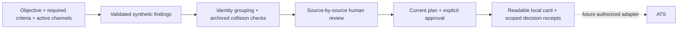

# Signal Desk

### Evidence first. Then a decision.

An interactive research workbench: set the search objective, required criteria and active research channels; inspect the source behind a claim; carry explicitly approved research into a readable local handoff card.

**[Open the working demo →](https://diadkoshmek.github.io/talent-research-workflow-prototype/?lang=en)** · **[Українською →](https://diadkoshmek.github.io/talent-research-workflow-prototype/?lang=uk)** · [Architecture](docs/architecture.md) · [Limits](docs/limits.md)


## Try to change its mind

The sample has **8 observations, 6 fictional people, 4 research hypotheses and 1 identity conflict**. There are no pre-approved people and no suitability scores.

1. Open Olena's three evidence items. Read each fictional source, write a reason and accept or reject the claim.
2. Confirm whether the sample records refer to the same person. Approval stays locked until all required criteria have accepted current evidence and identity is confirmed.
3. Approve the research handoff, then open the recipient card. For each required criterion it shows the accepted quote, source, review reason, reviewer and approval, followed by what remains unknown and the next human step. Download the standalone HTML card; JSON is available for technical inspection.
4. Reject an accepted claim or change the observation cutoff. The old approval no longer stands.
5. Select the identity-collision or future-date scenario and observe the refusal.

**One-minute plan challenge:** after approving Olena, open “The brief drives the research,” turn off the `automation-builders` channel while keeping automation required, and record a reason. All prior reviews, identity confirmations and approvals reset. Olena now lacks accepted automation evidence, and the handoff closes. A known identity conflict still blocks handoff even if its conflicting channel is inactive.

This is a **working offline interaction**, not live recruiting. The built-in people and source documents are fictional. Imported sample content is labelled as unverified; a synthetic reference does not establish fictionality. Objective text explains the intent; selected criteria and channels govern which already-collected observations appear in the current review. Switching a channel off does not stop or start a real search. There is no AI interpretation of the text or real source search. Session changes disappear on reload. The readable HTML and JSON files download locally; neither writes to an ATS.

For a tougher review, import the [fictional webinar example](examples/webinar-rehearsal.json). It quotes training attendance against a criterion for hands-on automation. Rejecting that claim leaves the handoff blocked. Accepting it can satisfy the formal rule, which shows why a human must judge the **meaning** of the source, not just whether its words appear in a document.

## The practical problem

The [A-Players Talent Engineer role](https://aplayers.na.teamtailor.com/jobs/617015-talent-engineer-ai-automation-a-players) asks for wider research, parallel sourcing hypotheses, reliable data and human ownership of hiring decisions. This prototype explores one possible seam: what happens between a proposed finding and research a teammate can inspect and reuse.

**Hypothesis to validate:** a shared evidence and review workflow could reduce repeated verification and handoff friction. The team's actual bottleneck and the effect on hiring speed remain unknown. The four channels here are example hypotheses, not executed searches.

## Run locally

Python 3 is enough to serve the static application. It has **zero runtime packages** and uses system fonts.

```bash
python3 -m http.server 8873 --bind 127.0.0.1
```

Open **http://127.0.0.1:8873/**. Use a current browser. Node 20+ is needed only for the engine tests:

```bash
npm test
npm run stress
```

No package installation, API key, login or candidate data is needed. `npm start` runs the same local server. The project-download button supplies a valid synthetic input example for the importer; imports start with no reviews or approvals.

## Small surface, explicit rules



One pure engine owns the rules in both browser and tests. The UI displays derived state; it cannot turn a badge into permission. Reviews belong to evidence items. Effective plan or cutoff changes reset reviews, identity confirmations and approvals. The recipient packet carries only the latest decisions supporting its currently accepted required evidence, identity confirmation and approval; the full in-session journal stays in the local workbench. Channel contribution counts only approved people with accepted fresh required evidence from that channel; a person can contribute to several channels, so these counts cannot be added as separate wins. Required-criterion coverage counts unique active people with fresh proposed versus accepted evidence. See the [full architecture and failure model](docs/architecture.md).

| Surface | Purpose |
| --- | --- |
| `src/engine.js` | Validated input, immutable session, policy, events and export |
| `src/app.js` | Bilingual working interface and local project import/download |
| `src/search-plan.js` | Search-plan controls, channel contributions and criterion coverage display |
| `src/handoff.js` | Readable recipient cards and standalone script-free HTML download |
| `tests/engine.test.mjs` | Adversarial contracts and deterministic replay |
| `scripts/stress.mjs` | Bounded repeat check of complete review/reset flows |
| `docs/pilot-plan.uk.md` | First conversation, baseline and one-search pilot |

## What has been checked

- Missing, stale, future-dated and conflicting evidence cannot silently pass the handoff gate.
- Review changes and effective plan or cutoff resets invalidate previous approval.
- Inactive channels have no current review workload; archived identity conflicts still block a person.
- Input/view mutations and prototype-shaped IDs do not forge approval.
- The browser flow has been exercised at desktop and phone sizes: review → identity → approve → export → change plan → inspect the evidence gap.
- The repeat check is local deterministic evidence, not a production load test or a measured improvement in recruiting.

[Verification record](docs/verification.md) · [Implemented behavior and known gaps](docs/limits.md)

## The first real pilot

Shadow the team's live searches first, agree on the biggest source of lost time, then test one small workflow against a recorded baseline. Connecting authorized research sources, Brain or TeamTailor comes after access, data rules and the actual process are understood. No such connectors are implemented here. [Pilot plan in Ukrainian](docs/pilot-plan.uk.md).

## Authorship

An independent proposal by **Artur**, developed with **Codex**. Artur supplied the practical brief and research direction; Codex produced the implementation and automated checks. Artur's background is construction. This artifact is a basis for assessing his reasoning and way of working with AI; it does not establish unaided programming proficiency. It is not affiliated with or endorsed by A-Players.

<details>
<summary>Earlier Python sketch</summary>

The original CLI is retained as an earlier reference, separate from the browser engine. It uses a smaller fixture and a simpler approval contract. Its results are not the browser's results.

```bash
python3 run_demo.py
python3 -m unittest discover -s tests -v
python3 stress.py
```

</details>
