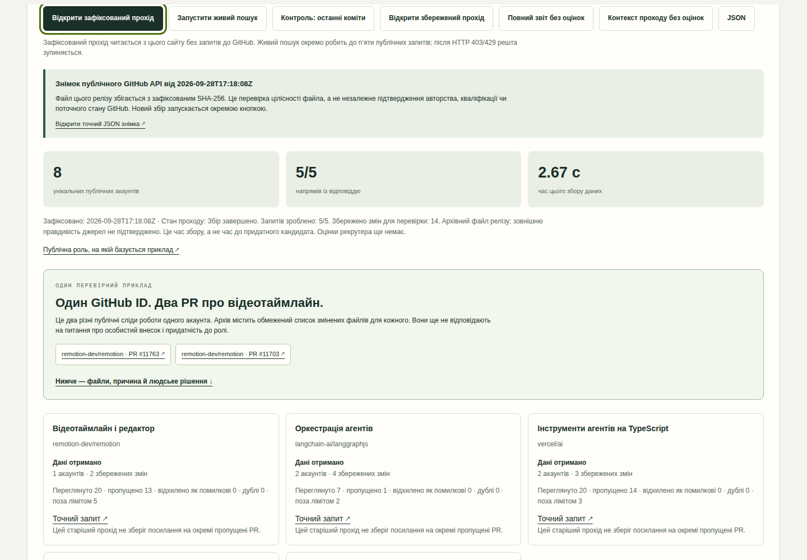

# Signal Desk — спочатку докази, потім рішення

**[Відкрити опубліковану версію →](https://diadkoshmek.github.io/talent-research-workflow-prototype/?lang=uk&showcase=1)** · [Архітектура](docs/architecture.md) · [План пілоту](docs/pilot-plan.uk.md)



*Знімок екрана v0.10.0 із релізним файлом фактичного публічного API-проходу. Оцінок рекрутера у файлі немає. [Докази збірки](docs/verification.md).*

Це інтерактивний прототип із двома різними шляхами. Перший збирає й дає людині оцінити публічні сліди змін у коді для [ролі Senior Agentic Software Engineer у Poolday](https://aplayers.na.teamtailor.com/jobs/536324-senior-agentic-software-engineer-poolday). Другий дає вручну перевірити вигадані докази та сформувати схвалений пакет. Він побудований для розмови про [роль Talent Engineer у A-Players](https://aplayers.na.teamtailor.com/jobs/617015-talent-engineer-ai-automation-a-players). Компанія його не замовляла й не схвалювала.

## Показ для зустрічі: роль → джерело → рішення

[Відкрити приклад відразу українською](https://diadkoshmek.github.io/talent-research-workflow-prototype/?lang=uk&showcase=1). У реліз включено **зафіксований фактичний прохід публічного GitHub API від 28 вересня 2026**: п’ять напрямів, вісім числових GitHub ID і 14 пов’язаних PR. Це архівні метадані, а не живий стан GitHub чи вісім кваліфікованих людей. Два PR одного ID у Remotion мають додаткові архівні зведення змінених файлів. Текст diff не публікується; точні PR відкриваються за посиланнями. У прикладі немає готових людських оцінок.

Застосунок завантажує цей файл із власного сайту без запиту до GitHub і перевіряє його SHA-256 проти значення в коді релізу. Це виявляє зміну файлу, **але не підтверджує правдивість GitHub, авторство чи якість роботи**. Після відкриття можна оцінити конкретне джерело з причиною, обрати тільки подальше дослідження і завантажити вузьку картку колезі. Окрема кнопка запускає **живий** пошук. Його частковий або невдалий результат показується окремо й не стирає архів чи записані рішення; перехід на новий результат потребує явного натискання.

Це самостійний прототип, без підключення до TeamTailor або Brain. Час збору метаданих не дорівнює часу до придатного кандидата; економію часу та корисність має оцінити рекрутер на погодженому пілоті.

## Публічний пошуковий прохід

Натисніть **«Запустити живий пошук»**. Браузер послідовно читає п’ять публічних пошукових запитів GitHub для прикладу ролі Poolday: спочатку відеотаймлайн у `remotion-dev/remotion`, потім оркестрація агентів у `langchain-ai/langgraphjs`, інструменти TypeScript у `vercel/ai`, програмовані редактори у `tldraw/tldraw` і відновлення агентів у `triggerdotdev/trigger.dev`. Для кожного напряму видно точний запит, скільки результатів переглянуто, пропущено й відкинуто як помилкові. Пошук відбирає злиті за останні 180 днів PR із технічною назвою та публічним автором типу `User`; залишає не більш як два різні GitHub ID і два PR на кожен ID у напрямі, до десяти ID загалом. Збіг імен не використовується. У разі HTTP 403/429 подальші запити цього проходу не робляться. Кнопка **«Контроль: останні коміти»** відкриває попередній вузький режим із трьома репозиторіями.

У новому живому проході без додаткових запитів зберігаються **канонічні PR, які відкинуло правило назви**: точне посилання, назва, дата та причина. Вони з’являються в окремому розкривному списку напряму, але не стають знахідками й не потрапляють у передачу автоматично. Зокрема, `fix: timeline frame alignment during trim` тепер видно як відсіяний через вимогу спеціального префікса Remotion. Старі збережені проходи, включно з релізним архівом, не мають таких записів: їх неможливо відновити зі старого звіту. Не кожен пропуск має придатний до показу канонічний запис.

Це **п’ять обраних репозиторіїв на одній платформі**, а не пошук по всьому ринку. Пошук обмежено першими 20 відповідями на кожен запит; технічна назва PR — лише слабкий сигнал. Два PR одного ID показують повторюваний слід роботи, але не є двома людьми. Тип `User` не доводить, що за акаунтом стоїть незалежна людина. Злитий PR пов’язує акаунт зі зміною, але не доводить особистий внесок, стаж, місце проживання, доступність чи відповідність вакансії. Результати не ранжують людей; рішення про подальшу перевірку й контакт залишаються людськими.

**Після збору є дослідницький цикл:** кнопка біля сліду читає точний PR і список його файлів двома явними запитами. Вона показує кількість файлів, зміни рядків, обмежені фрагменти diff і збіг числового GitHub ID. Для старого режиму комітів працює окремий точний запит. Повний diff лишається на GitHub. Виявлений конфлікт ID записується в журнал, відкликає попередню передачу й блокує позитивну оцінку цього сліду. Збіг ID не доводить особистого внеску чи придатності людини.

Людина позначає слід як корисний, некорисний або неясний, записує причину й окремо вирішує, чи передавати акаунт наступному досліднику. Передача вимагає хоча б одного корисного сліду; зміна оцінки скасовує попереднє рішення. «Зберегти всю перевірку» дає звіт разом із журналом для продовження, а картка колезі містить лише вибрані сліди, причини й невідомі питання. Огляд diff живе лише в поточній вкладці й не додається до картки. Це не схвалення кандидата й не дозвіл на контакт. Журнал не зберігається автоматично: перед перезавантаженням збережіть файл.

**Окремий блок «Чи це допомогло людині?»** створює знімок вибраних слідів і дозволяє внести оцінку та хвилини ручної перевірки для кожного акаунта. Його можна зберегти й відновити окремим JSON. Оцінка локальна й не автентифікована; стан «корисно» не означає, що рекрутер прийняв кандидата. Початково цей блок порожній. Порівняння зі звичним процесом і реальний відгук команди ще потрібні.

**«Повний звіт без оцінок»** дає окремий HTML, поруч доступний JSON. Збережений JSON обох режимів можна імпортувати в цю секцію; походження імпортованого файлу не автентифіковане. Звіт публічного пошуку не стає доказом у ручній черзі й не входить до схваленого пакета. Ключ API та вхід у GitHub не потрібні, але мережа й відкритий API потрібні під час нового збору; анонімний ліміт GitHub може обмежити результат.

## Показ, який пояснює себе

Натисніть **«Подивитися показ із поясненнями»**. П’ять кроків ведуть від задачі через недостатній доказ до зрозумілого пакета та відкликання схвалення. На кожному кроці є джерело, наслідок і коротка головна думка. Рішення в цьому вигаданому сценарії автоматично відтворюються через те саме ядро правил; вони не приписуються глядачу. Показ не змінює ручну чергу. Його можна завантажити як окрему HTML-сторінку для читання офлайн.

Параметр `?lang=uk&demo=1` одразу відкриває показ. Для власної перевірки є робоча черга з підказкою наступного кроку.

## Перерва й продовження

Ухвалені рішення та план автоматично зберігаються в цьому браузері на цьому пристрої. Після перезавантаження вони відновлюються через правила ядра. Незавершений текст у полях не зберігається. Якщо сховище недоступне або інша вкладка змінила збереження, екран це повідомляє; поточну роботу можна завантажити окремо.

**«Зберегти сесію у файл»** зберігає весь проєкт і журнал. **«Відновити з файлу»** перевіряє формат, розмір і послідовність дій перед заміною поточної сесії. Це повна копія для продовження, а **«Пакет»** — окремий результат для рекрутера. Файл не підтверджує авторство й не захищає від узгодженого переписування історії. Одночасне редагування кількома вкладками не підтримується як спільна робота.

## Перевірити вручну

1. Натиснути «Почати ручний приклад заново». Це скидає ручну чергу до базового прикладу. Відкрити три докази Олени.
2. Прочитати джерело, написати своїми словами причину й прийняти або відхилити кожен доказ.
3. Підтвердити зв'язок записів з однією особою. Лише після повного покриття критеріїв активується «Схвалити передачу».
4. Відкрити «Пакет»: для кожного обов’язкового критерію видно прийняту цитату, джерело, причину перевіряльника, його ім’я та схвалення. Нижче — що лишається невідомим і наступний крок рекрутера. Завантажити зрозумілу HTML-картку, яка відкривається окремо без мережі; JSON є додатковим технічним форматом.
5. Змінити дату врахування спостережень: попередні перевірки та схвалення скасуються. Це показує, що старе рішення не переживає зміну умов автоматично.

**Виклик плану за хвилину:** схвали Олену, відкрий «Запит керує пошуком», вимкни напрям «Практики автоматизації» (`automation-builders`), але залиш автоматизацію обов’язковим критерієм, і запиши причину. Старі перевірки, підтвердження особи й схвалення скинуться. Для Олени тепер бракує прийнятого доказу автоматизації, тож передача закрита. Відомий конфлікт особи лишається перешкодою навіть після вимкнення напряму, де його знайшли.

У вбудованому **ручному** прикладі 8 знахідок, 6 вигаданих людей, 4 гіпотези пошуку й 1 конфлікт особи. Джерела вигадані та відкриваються всередині сторінки. Текст задачі пояснює задум; вибрані критерії й напрями визначають, які **вже зібрані** знахідки потрапляють у поточну перевірку. Перемикач напряму не запускає і не зупиняє публічний збір GitHub. ШІ не тлумачить текст і не оцінює людей. Імпортований приклад може містити текст користувача, вигаданість якого система не доводить. Ухвалені рішення зберігаються локально, якщо браузер дозволяє сховище; HTML-картка, JSON і резервна сесія не надсилаються в системи компанії.

Для складнішої репетиції можна імпортувати [вигаданий приклад із вебінаром](examples/webinar-rehearsal.json). У ньому проходження навчання подано як цитату до критерію «власноруч упроваджена автоматизація». Відхили цей доказ — передача лишиться закритою. Якщо його прийняти, формальне правило може дозволити передачу: система не розуміє, чи справді навчання доводить практичний досвід. Це рішення людини.

## Запуск

Потрібен Python 3; встановлювати пакети не треба:

```bash
python3 -m http.server 8873 --bind 127.0.0.1
```

Відкрити http://127.0.0.1:8873/ у браузері. Для перевірок рушія потрібен Node 20+:

```bash
npm test
npm run stress
```

Для окремого запуску **попереднього режиму комітів** з командного рядка:

```bash
python3 scripts/research_pass.py --live --output /tmp/signal-desk-research.json
```

Команда робить три публічні GET-запити й пише JSON лише у вказаний локальний файл. Без `--live` вона показує довідку. Новий пошук злитих PR поки вбудовано лише у браузер (`src/role-search.js`).

## Що тут має переконувати

Публічний прохід демонструє конкретні запити, посилання на зміни й видимі прогалини. Ручний приклад показує задачу, джерело твердження, рішення людини та наслідок: можна відхилити доказ, змінити дату чи план, дати суперечливі записи. Пакет містить лише останні рішення, що підтримують поточну передачу; повний журнал дій лишається у робочій сесії. Лічильники ручної черги показують внесок напряму лише через прийнятий актуальний доказ обов’язкового критерію. Одну людину можуть знайти кілька напрямів, тому їхні внески не додаються як окремі успіхи. Таблиця покриття рахує унікальних людей із запропонованим і прийнятим доказом для кожного обов’язкового критерію.

Користь для рекрутингу треба вимірювати окремо. Цей прототип не доводить швидший найм або професійну придатність людей. [Реальні перевірки](docs/verification.md), [межі](docs/limits.md), [перший пілот](docs/pilot-plan.uk.md).

## Авторство

Артур задав практичну задачу та напрям дослідження. Codex реалізував код і автоматичні перевірки. Артур працює в будівництві й досліджує створення систем разом із ШІ. Прототип дає предмет для розмови про його мислення та спосіб роботи; сам по собі не доводить самостійне володіння програмуванням.

Оригінальний Python-приклад лишається ранньою окремою версією. Активний інтерфейс працює на `src/engine.js`; його правила й дані відрізняються від старого CLI.

[Межі безпеки й реалізовані захисти](docs/security.md).

**Передача роботи колезі:** після пошукового проходу кнопка «Контекст проходу без оцінок» завантажує Markdown із задачею, джерелами, результатом, невідомими питаннями та наступними перевірками. Це переносний контекст; Brain або інші системи компанії не викликаються.
