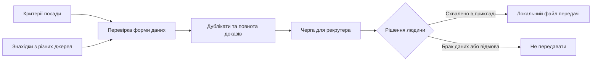

# Передача дослідження рекрутеру — прототип

Це невеликий приклад для обговорення [вакансії A-Players](https://aplayers.na.teamtailor.com/jobs/617015-talent-engineer-ai-automation-a-players). Усі люди й джерела в прикладі **вигадані**. Проєкт не пов'язаний із компанією й не використовує її внутрішні дані.

## Яку задачу показує

Знахідки про можливих кандидатів надходять із кількох місць. Перед тим як передати їх рекрутеру, треба звести дублікати, показати джерела, застарілі дані та відсутні підтвердження. **Людина перевіряє джерела і приймає рішення.** Програма не пише кандидатам і не вирішує, кого наймати.



У [прикладі результату](examples/review_queue.json) шість знахідок стосуються п'яти вигаданих людей: одну людину знайшли двічі. Для двох людей бракує свіжих даних. Три записи готові **лише до перевірки джерел людиною**. [Файл передачі](examples/mock_approved_handoff.json) містить одного кандидата після умовного людського схвалення.

## Як запустити

Потрібен Python 3.11 або новіший. Інших бібліотек не потрібно.

```bash
python3 run_demo.py
python3 -m unittest discover -s tests -v
python3 stress.py
```

Перша команда створює локальні файли в папці `out/`; друга запускає перевірки; третя повторює той самий шлях 200 разів і перевіряє стабільність результату.

## Чого тут ще немає

Справжнього пошуку людей, виклику мовної моделі, перевірки реальних посилань, підключення до TeamTailor і доказу, що компанія стала наймати швидше. Це **публічний прототип межі між дослідженням і перевіркою людиною**. Перед роботою зі справжніми даними треба побачити їхній процес, правила доступу та критерії якості.

Код створено з допомогою ШІ. Деталі для технічного перегляду: [архітектура англійською](docs/architecture.md) та [межі англійською](docs/limits.md).
