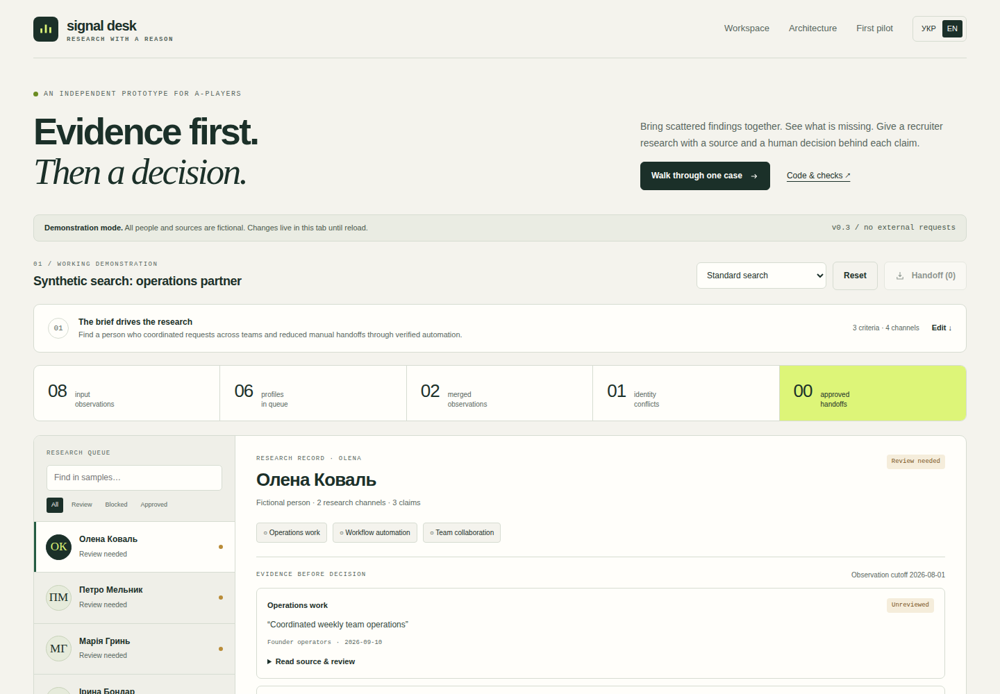

# Signal Desk — спочатку докази, потім рішення

**[Відкрити робочий прототип →](https://diadkoshmek.github.io/talent-research-workflow-prototype/?lang=uk)** · [Архітектура](docs/architecture.md) · [План пілоту](docs/pilot-plan.uk.md)



Це інтерактивний прототип: ти формулюєш задачу пошуку, вибираєш обов’язкові критерії та напрями дослідження, перевіряєш джерела й передаєш рекрутеру лише схвалені докази. Він побудований для розмови про публічну роль Talent Engineer у A-Players. Компанія його не замовляла й не схвалювала.

## Показ за три хвилини

1. Натиснути «Пройти один приклад». Відкрити три докази Олени.
2. Прочитати джерело, написати своїми словами причину й прийняти або відхилити кожен доказ.
3. Підтвердити зв'язок записів з однією особою. Лише після повного покриття критеріїв активується «Схвалити передачу».
4. Відкрити «Пакет»: там людина, прийняті джерела, критерії, причини й журнал дій.
5. Змінити дату врахування спостережень: попередні перевірки та схвалення скасуються. Це показує, що старе рішення не переживає зміну умов автоматично.

**Виклик плану за хвилину:** схвали Олену, відкрий «Запит керує пошуком», вимкни напрям «Практики автоматизації» (`automation-builders`), але залиш автоматизацію обов’язковим критерієм, і запиши причину. Старі перевірки, підтвердження особи й схвалення скинуться. Для Олени тепер бракує прийнятого доказу автоматизації, тож передача закрита. Відомий конфлікт особи лишається перешкодою навіть після вимкнення напряму, де його знайшли.

У вбудованому прикладі 8 знахідок, 6 вигаданих людей, 4 гіпотези пошуку й 1 конфлікт особи. Джерела вигадані та відкриваються всередині сторінки. Текст задачі пояснює задум; правила задаються вибраними критеріями й напрямами. ШІ не тлумачить текст автоматично й не шукає реальних людей. Імпортований приклад може містити текст користувача, вигаданість якого система не доводить. Зміни зникають після перезавантаження вкладки; локальний пакет містить прийняті актуальні докази вибраних обов’язкових критеріїв і не надсилається в системи компанії.

## Запуск

Потрібен Python 3; встановлювати пакети не треба:

```bash
python3 -m http.server 8873 --bind 127.0.0.1
```

Відкрити http://127.0.0.1:8873/ у браузері. Для перевірок рушія потрібен Node 20+:

```bash
npm test
npm run stress
```

## Що тут має переконувати

Видно задачу, джерело твердження, невизначеність, рішення людини та його наслідок. Приклад можна перевірити: відхилити доказ, змінити дату чи план, дати суперечливі записи. Рушій має пояснити, чому передача тепер закрита. Лічильники показують внесок кожного напряму лише через прийнятий актуальний доказ обов’язкового критерію. Одну людину можуть знайти кілька напрямів, тому їхні внески не додаються як окремі успіхи. Таблиця покриття рахує унікальних людей із запропонованим і прийнятим доказом для кожного обов’язкового критерію.

Користь для рекрутингу треба вимірювати окремо. Цей прототип не доводить швидший найм або професійну придатність людей. [Реальні перевірки](docs/verification.md), [межі](docs/limits.md), [перший пілот](docs/pilot-plan.uk.md).

## Авторство

Артур задав практичну задачу та напрям дослідження. Codex реалізував код і автоматичні перевірки. Артур працює в будівництві й досліджує створення систем разом із ШІ. Прототип дає предмет для розмови про його мислення та спосіб роботи; сам по собі не доводить самостійне володіння програмуванням.

Оригінальний Python-приклад лишається ранньою окремою версією. Активний інтерфейс працює на `src/engine.js`; його правила й дані відрізняються від старого CLI.
