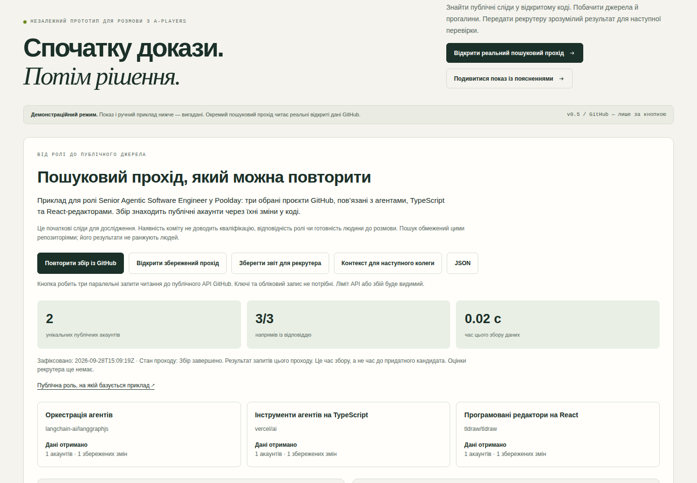

# Signal Desk — спочатку докази, потім рішення

**[Відкрити опубліковану версію →](https://diadkoshmek.github.io/talent-research-workflow-prototype/?lang=uk)** · [Архітектура](docs/architecture.md) · [План пілоту](docs/pilot-plan.uk.md)



*Знімок v0.5 із синтетичними відповідями API. Окремий справжній прохід і браузерні перевірки зафіксовані у [журналі](docs/verification.md).*

Це інтерактивний прототип із двома окремими проходами. Перший збирає публічні сліди змін у коді для [ролі Senior Agentic Software Engineer у Poolday](https://aplayers.na.teamtailor.com/jobs/536324-senior-agentic-software-engineer-poolday). Другий дає вручну перевірити вигадані докази та сформувати схвалений пакет. Він побудований для розмови про [роль Talent Engineer у A-Players](https://aplayers.na.teamtailor.com/jobs/617015-talent-engineer-ai-automation-a-players). Компанія його не замовляла й не схвалювала.

## Публічний пошуковий прохід

Натисніть **«Запустити збір із GitHub»**. Браузер робить три паралельні запити читання до відкритого API GitHub: останні 20 комітів у `langchain-ai/langgraphjs`, `vercel/ai`, `tldraw/tldraw`. Прохід показує до двох акаунтів із кожного репозиторію й до шести унікальних акаунтів загалом. Однакові GitHub ID об’єднуються; збіг імен не використовується. Для кожного збережено посилання на профіль, коміт, репозиторій і дату. Помилки джерел та неповний збір видно в звіті.

Це **три обрані репозиторії на одній платформі**, а не пошук по всьому ринку. Коміт пов’язує акаунт зі зміною, але не доводить його роль у її створенні, стаж, місце проживання, доступність чи відповідність вакансії. Людина має відкрити зміни й перевірити ці питання. Жодного ранжування людей або автоматичного рішення про контакт немає.

**«Зберегти звіт для рекрутера»** дає окремий HTML, поруч доступний JSON. Збережений JSON можна імпортувати в цю секцію; походження імпортованого файлу не автентифіковане. Звіт публічного пошуку не стає доказом у ручній черзі й не входить до схваленого пакета. Ключ API та вхід у GitHub не потрібні, але мережа й відкритий API потрібні під час нового збору; ліміт GitHub може обмежити результат.

## Показ, який пояснює себе

Натисніть **«Подивитися показ із поясненнями»**. П’ять кроків ведуть від задачі через недостатній доказ до зрозумілого пакета та відкликання схвалення. На кожному кроці є джерело, наслідок і коротка головна думка. Рішення в цьому вигаданому сценарії автоматично відтворюються через те саме ядро правил; вони не приписуються глядачу. Показ не змінює ручну чергу. Його можна завантажити як окрему HTML-сторінку для читання офлайн.

Параметр `?lang=uk&demo=1` одразу відкриває показ. Для власної перевірки є робоча черга з підказкою наступного кроку.

## Перерва й продовження

Ухвалені рішення та план автоматично зберігаються в цьому браузері на цьому пристрої. Після перезавантаження вони відновлюються через правила ядра. Незавершений текст у полях не зберігається. Якщо сховище недоступне або інша вкладка змінила збереження, екран це повідомляє; поточну роботу можна завантажити окремо.

**«Зберегти сесію у файл»** зберігає весь проєкт і журнал. **«Відновити з файлу»** перевіряє формат, розмір і послідовність дій перед заміною поточної сесії. Це повна копія для продовження, а **«Пакет»** — окремий результат для рекрутера. Файл не підтверджує авторство й не захищає від узгодженого переписування історії. Одночасне редагування кількома вкладками не підтримується як спільна робота.

## Перевірити вручну

1. Натиснути «Почати ручний приклад заново». Це скидає ручну чергу до базового прикладу. Відкрити три докази Олени.
2. Прочитати джерело, написати своїми словами причину й прийняти або відхилити кожен доказ.
3. Підтвердити зв'язок записів з однією особою. Лише після повного покриття критеріїв активується «Схвалити передачу».
4. Відкрити «Пакет»: для кожного обов’язкового критерію видно прийняту цитату, джерело, причину перевіряльника, його ім’я та схвалення. Нижче — що лишається невідомим і наступний крок рекрутера. Завантажити зрозумілу HTML-картку, яка відкривається окремо без мережі; JSON є додатковим технічним форматом.
5. Змінити дату врахування спостережень: попередні перевірки та схвалення скасуються. Це показує, що старе рішення не переживає зміну умов автоматично.

**Виклик плану за хвилину:** схвали Олену, відкрий «Запит керує пошуком», вимкни напрям «Практики автоматизації» (`automation-builders`), але залиш автоматизацію обов’язковим критерієм, і запиши причину. Старі перевірки, підтвердження особи й схвалення скинуться. Для Олени тепер бракує прийнятого доказу автоматизації, тож передача закрита. Відомий конфлікт особи лишається перешкодою навіть після вимкнення напряму, де його знайшли.

У вбудованому **ручному** прикладі 8 знахідок, 6 вигаданих людей, 4 гіпотези пошуку й 1 конфлікт особи. Джерела вигадані та відкриваються всередині сторінки. Текст задачі пояснює задум; вибрані критерії й напрями визначають, які **вже зібрані** знахідки потрапляють у поточну перевірку. Перемикач напряму не запускає і не зупиняє публічний збір GitHub. ШІ не тлумачить текст і не оцінює людей. Імпортований приклад може містити текст користувача, вигаданість якого система не доводить. Ухвалені рішення зберігаються локально, якщо браузер дозволяє сховище; HTML-картка, JSON і резервна сесія не надсилаються в системи компанії.

Для складнішої репетиції можна імпортувати [вигаданий приклад із вебінаром](examples/webinar-rehearsal.json). У ньому проходження навчання подано як цитату до критерію «власноруч упроваджена автоматизація». Відхили цей доказ — передача лишиться закритою. Якщо його прийняти, формальне правило може дозволити передачу: система не розуміє, чи справді навчання доводить практичний досвід. Це рішення людини.

## Запуск

Потрібен Python 3; встановлювати пакети не треба:

```bash
python3 -m http.server 8873 --bind 127.0.0.1
```

Відкрити http://127.0.0.1:8873/ у браузері. Для перевірок рушія потрібен Node 20+:

```bash
npm test
npm run stress
```

Для окремого запуску того самого обмеженого публічного збору з командного рядка:

```bash
python3 scripts/research_pass.py --live --output /tmp/signal-desk-research.json
```

Команда робить три публічні GET-запити й пише JSON лише у вказаний локальний файл. Без `--live` вона показує довідку. Це окрема точка запуску; браузер використовує `src/research.js`.

## Що тут має переконувати

Публічний прохід демонструє конкретні запити, посилання на зміни й видимі прогалини. Ручний приклад показує задачу, джерело твердження, рішення людини та наслідок: можна відхилити доказ, змінити дату чи план, дати суперечливі записи. Пакет містить лише останні рішення, що підтримують поточну передачу; повний журнал дій лишається у робочій сесії. Лічильники ручної черги показують внесок напряму лише через прийнятий актуальний доказ обов’язкового критерію. Одну людину можуть знайти кілька напрямів, тому їхні внески не додаються як окремі успіхи. Таблиця покриття рахує унікальних людей із запропонованим і прийнятим доказом для кожного обов’язкового критерію.

Користь для рекрутингу треба вимірювати окремо. Цей прототип не доводить швидший найм або професійну придатність людей. [Реальні перевірки](docs/verification.md), [межі](docs/limits.md), [перший пілот](docs/pilot-plan.uk.md).

## Авторство

Артур задав практичну задачу та напрям дослідження. Codex реалізував код і автоматичні перевірки. Артур працює в будівництві й досліджує створення систем разом із ШІ. Прототип дає предмет для розмови про його мислення та спосіб роботи; сам по собі не доводить самостійне володіння програмуванням.

Оригінальний Python-приклад лишається ранньою окремою версією. Активний інтерфейс працює на `src/engine.js`; його правила й дані відрізняються від старого CLI.

[Межі безпеки й реалізовані захисти](docs/security.md).

**Передача роботи колезі:** після пошукового проходу кнопка «Контекст для наступного колеги» завантажує Markdown із задачею, джерелами, результатом, невідомими питаннями та наступними перевірками. Це переносний контекст; Brain або інші системи компанії не викликаються.
