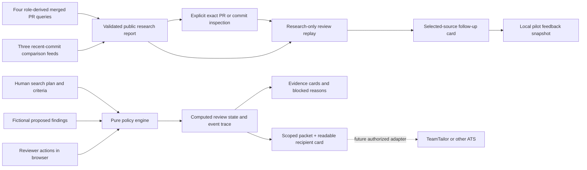
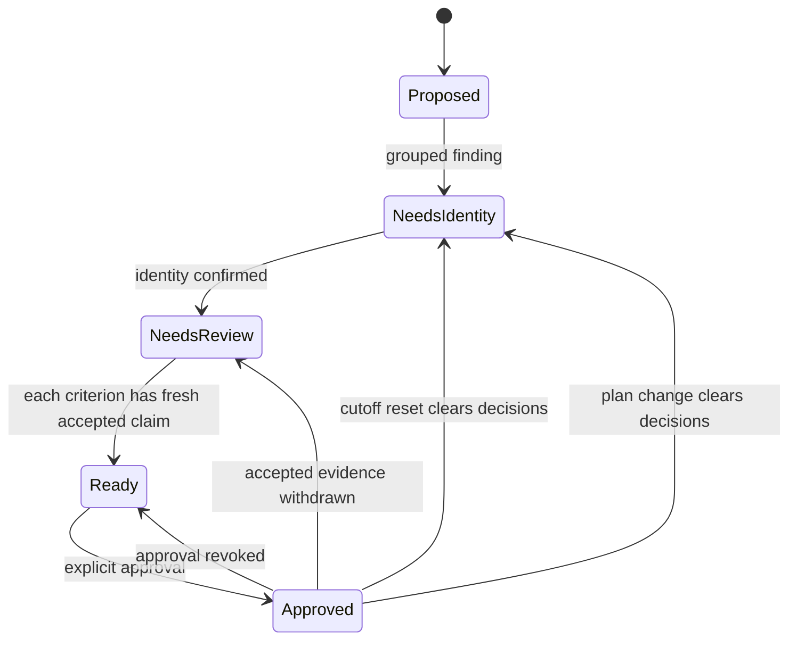
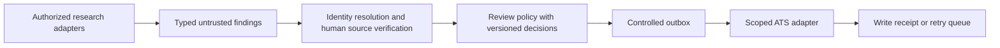

# Signal Desk architecture

Signal Desk demonstrates a bounded read-only public GitHub pass with a separate human source-review and further-research handoff, plus a fictional criterion-by-criterion approval engine. These paths have different authorities. The [public Talent Engineer posting](https://aplayers.na.teamtailor.com/jobs/617015-talent-engineer-ai-automation-a-players) motivates the workflow; the research pass uses the [public Poolday Senior Agentic Software Engineer posting](https://aplayers.na.teamtailor.com/jobs/536324-senior-agentic-software-engineer-poolday) as its concrete brief. The manual fixture contains fictional people. This independent artifact is not an A-Players system.

## Decision boundary

Several observations about one apparent person may come from different research hypotheses. A name match is not identity proof; a source quotation is not verified evidence; accepting one claim does not validate every claim from a source. The design keeps five decisions separate:

1. **Plan:** What problem is this search for, which existing criteria are required, and which existing research channels participate?
2. **Intake:** Is a proposed record well formed and within the role's declared criteria?
3. **Identity:** Does a reviewer confirm that the grouped observations refer to one person?
4. **Evidence:** Has the reviewer accepted this particular claim, from this particular source, for this particular criterion? Is its observation date inside the chosen review window?
5. **Handoff:** Does every selected required criterion have accepted fresh evidence, with confirmed identity and explicit approval?

The browser interface makes those decisions inspectable. It does not rank candidates or decide suitability or hiring.

## Present layers and API

`src/engine.js` is the canonical manual-review policy engine, with no browser or network dependency. `src/app.js` renders its state, dispatches actions, and accepts local JSON project imports; `src/search-plan.js` renders plan controls, channel results, and required-criterion coverage; `src/handoff.js` renders the packet into recipient cards and a standalone script-free HTML document; `src/style.css` owns the workbench presentation. The static page has no login, server, model call, ATS or Brain connector. A deliberate research click does make public GitHub API requests. Recorded manual decisions and their initial project are saved to local browser storage when available, then reconstructed by engine replay after reload. Unsubmitted input drafts are not persisted. Exports are local HTML and JSON downloads. The older `research_handoff.py` and JSON examples are a separate reference; the browser does not call that Python module.

`src/role-search.js` owns the primary role-derived merged-PR search and strict v2 report validation. `src/research.js` retains the earlier commit comparison pass and dispatches both report schemas. `src/github-public-read.js` owns one bounded outbound policy. `src/research-view.js` renders an inspectable report and standalone HTML. `src/research-note.js` derives a portable Markdown continuation note from the validated report: role, source rationale and queries, observed findings, unknowns and next colleague checks. It is an explicit local download, not a Brain integration or an authenticated decision record. `scripts/research_pass.py` is a separate Python 3 CLI for the older three-commit-feed pass only. Neither browser collection path feeds findings into the fictional manual review engine. The research report has its own import/download controls and is not a candidate approval or ATS write.

The engine contract is `demoProject(scenario)` for a fictional project, `createSession(project)` for initial state, `transition(state, action)` for an immutable next state, `viewSession(state)` for a read model, and `exportHandoff(state)` for the approved local packet. The view exposes project, active plan, revision, candidates, hypotheses, criterion coverage, metrics, the full local event journal, and export packet. The packet declares `signal-desk-handoff.v2`, `synthetic-local-demo`, `self-attested, unauthenticated`, and `eventsScope: latest-supporting-decisions-only`. It carries the selected criteria/channels, objective, current accepted fresh required evidence, reviewer reasons, and the latest identity and approval receipts. It omits unrelated historical actions, global policy events, and `plan.reason`. These fields describe a bounded recipient snapshot; they do not authenticate a reviewer or certify a source. The UI supports Ukrainian and English labels; language does not alter policy.

## Role-derived search contract (v0.8)

The primary browser path maps four visible technical axes from the Poolday role to four seeded repositories: agent orchestration (`langchain-ai/langgraphjs`), TypeScript tools (`vercel/ai`), React editor work (`tldraw/tldraw`), and agent recovery (`triggerdotdev/trigger.dev`). It runs four sequential GitHub issue-search requests for merged PRs with a term in the title and a 180-day updated window. From the first 20 API results per lane, it retains only PRs actually merged within 180 days, with a technical `feat/fix/perf/refactor` title, a matching lane term, a canonical source URL and a GitHub `User` account. These are heuristic filters for a review queue, not skill classification. At most two distinct IDs per lane and eight overall are retained. Every scanned row is accounted for as retained, skipped, malformed, duplicate or beyond the two-account cap. Search results can be incomplete, mislabelled or missed by the first-page/title filters; counts and exact query URLs are visible.

`signal-desk-research.v2` binds four fixed lanes, search URLs, source IDs, merged dates, lane counts and account IDs. An explicit source-inspection click reads the exact PR and its files with two bounded GETs, checks PR number, URL, merge date and numeric author ID, and shows at most eight file excerpts. More files may exist. A conflicting author ID records a sticky local source conflict and revokes earlier follow-up. The human can assess relevance, select a further-research handoff, then record an independent local feedback snapshot. No search result, PR title, matching account ID or feedback form proves individual authorship, role fit, recruiter acceptance or measured benefit. Imported report/review/feedback files are structurally checked but unauthenticated.

## Earlier commit comparison contract (v0.5)

The three seeded lanes are `langchain-ai/langgraphjs` (agent orchestration), `vercel/ai` (TypeScript AI tooling), and `tldraw/tldraw` (programmable React editors). The browser uses `Promise.all` for three GitHub public `/commits?per_page=20` reads; the Python CLI uses three worker threads. At most two accounts per lane and two associated commits per account per lane are retained, for at most six distinct GitHub account IDs across lanes. A GitHub ID, not a name, joins repeated observations. The commit link, repository, first-line title and timestamps are inspectable, but this association does not prove depth of contribution, employment, tenure, location, availability, or suitability.

Each lane records scanned, skipped, rejected and retained counts; a request failure or wholly malformed rows mark the lane as an error; usable observations alongside malformed rows produce a partial lane. The report records elapsed request time and `complete`, `partial` or `failed` collection status. This is time to collect public metadata, never time to a qualified candidate. GitHub may rate-limit unauthenticated calls. The schema `signal-desk-research.v1` validates fixed lanes, source URLs, identifiers and size before imported reports are displayed. That structural validation does not authenticate an imported JSON file or establish the truth of a commit title. HTML output escapes displayed text and contains no script. A downloaded research report persists only through explicit file export/import; manual-session autosave covers the fictional review queue only.

## Public-source decision loop (v0.6)

`src/research-review.js` adds an independent `signal-desk-research-review.v1` session for either validated report schema: the exact report plus a bounded action list. Its reducer replays source decisions (`relevant`, `irrelevant`, `uncertain`) and account decisions (`follow-up`, `hold`). Each needs an 8–400 character reason. A follow-up requires at least one source judged relevant by the local reviewer. Every later source decision for the same account withdraws the previous account decision, including a same-value reassessment; there is no silent reactivation. A fresh collection creates a new empty review even when GitHub IDs repeat. A malformed import keeps the current browser state.

`researchReviewPacket` derives `signal-desk-research-follow-up.v1` only from current follow-up decisions and their relevant sources. It omits held accounts, rejected/uncertain sources and the complete journal. The result is strictly **further research**, without candidate approval, contact or ATS authority. The HTML renderer is script-free, escapes source and reviewer text, and includes source links, reasons, unknowns and provenance limits. Imported report or session files are structurally validated but unauthenticated. A coherent forged journal is possible; the file is a self-attested demonstration, not an audit. At 100 actions the review is read-only and recipient export is blocked.

The browser uses explicit local file download/restore for the real-source review. It does not autosave public account data. The existing fictional engine and its local autosave remain separate because its `synthetic://` source contract would otherwise misrepresent GitHub associations as verified criterion evidence. Current public-source review does **not** inspect diffs automatically, identify a person beyond GitHub ID, establish role fit, or verify a recruiter outcome.

## Exact source inspection and outcome loop (v0.7)

`src/github-public-read.js` is the shared outbound policy: HTTPS GitHub search, PR and commit endpoints, `GET` without credentials, no redirects, ten-second timeout and a bounded streamed JSON body. `src/source-inspection.js` derives the exact detail URL from a validated report and requires the returned source identity and canonical HTML URL to match the saved source. It exposes GitHub's file and line counts, at most eight filenames, and short escaped diff excerpts. The preview is deliberately incomplete; a test-file path does not prove the tests ran. It does not store patch text in any export.

The numeric GitHub author ID in the detail is checked against the report's account ID. A mismatch adds a `source-conflict` action to the research review. Replay makes this conflict sticky for that review, removes that source's prior positive assessment and withdraws the account's prior follow-up choice. A later positive action for that source is refused by the policy engine, not merely by the button. A new report starts a new review. Matching IDs are still an association, not proof of authorship depth. Imported histories and API responses are not authenticated; an edited local file can omit a conflict, so this is an integrity rule for the current session rather than a trusted audit.

`src/pilot-feedback.js` creates a separate `signal-desk-pilot-feedback.v1` snapshot from a selected follow-up packet. It accepts local, reasoned outcomes (`useful-next-step`, `not-useful`, `unclear`) and manually entered review minutes for each selected GitHub ID; latest actions determine the displayed counts. It has a 60-action, 1 MiB bound and explicit JSON save/restore. Assessor context, including “recruiter-reported,” is self-attested. The snapshot can differ from a later live review. No baseline, recruiter identity, candidate acceptance or hiring result is inferred from it. A real pilot needs an agreed conventional-process baseline and direct recruiter assessment before measuring benefit.

## Data and action contracts

| Object | Fields or meaning | Trust |
| --- | --- | --- |
| Project | `id`, `title`, optional `objective` (defaults to title), fixed replay date `asOf`, `cutoff`, available `criteria`, research `hypotheses`, `findings` | Built-in fictional fixture or user-supplied local JSON |
| Active search plan | Bilingual objective, selected required criterion IDs, selected existing hypothesis IDs, change reason | Human configuration; defaults to all criteria and channels |
| Finding | `id`, declared `personKey`, display `name`, `identityRef`, `hypothesisId`, source, criterion claims | Untrusted proposed research |
| Source | Reference, title, inspectable text, `observedAt` | Citation for human inspection, not verified truth |
| Claim | `criterionId`, quoted supporting text | Untrusted claim against one criterion |
| Review action | Evidence ID, accept/reject, reviewer, reason | In-session human assertion |
| Identity action | Person key, confirmed state, reviewer | In-session human assertion |
| Handoff action | Approve/revoke, person key, reviewer | Revocable in-session authorization |
| Cutoff action | New date; clears prior reviews, identity confirmations, approvals | Role policy change |
| Plan action | `setPlan` with objective, nonempty existing criterion and hypothesis selections, reason, reviewer; clears reviews, identity confirmations, approvals | Search-policy change |

An accepted observation is research evidence for a reviewer to consider, not proof that its content is true in the world. `observedAt` means when the observation was recorded. `asOf` is a supplied replay snapshot (2026-09-28 in the standard example); a finding dated after it is refused. Validation compares dates with this snapshot, not the computer's current clock. An observation date does not establish when the source last changed, current employment, consent, or candidate fit. A new cutoff resets review decisions rather than carrying approvals across a changed policy.

The local JSON importer accepts the same validated project shape and allows source references beginning with `synthetic://`; it does not fetch sources. A source includes the full inspectable text, and each claim's quote must appear in that text. This is a structural check, not external verification. The engine cannot prove that user-supplied text describes fictional people. The UI labels imported content as unverified fictionality and starts a fresh session with no reviews, identity confirmations, or approvals.

The manual plan can change the objective wording, require a subset of existing criteria, and activate a subset of existing fictional research channels. It does not parse natural language or control GitHub collection. Active manual channels filter **already-collected** fictional observations and claims in the current review and handoff; a switch does not start or stop public sourcing. Identity conflicts are checked against **all archived findings**, including inactive channels, so hiding one channel cannot turn a known ambiguous identity into a safe one. Every plan change records the reason and reviewer in the local journal and invalidates prior reviews, identity confirmations, and approvals.

## State and invariants

The diagram is illustrative: identity can be confirmed before or after evidence review. Status is derived from the current project, active plan, and actions, never an independent permission flag. Export is fail closed when identity is unconfirmed, any **selected required** criterion lacks at least one accepted fresh claim from an active channel, or approval is missing. A pending or rejected alternative does not block a criterion already covered by another accepted fresh claim. Duplicate observations retain distinct source references; reviewing one evidence item never reviews another. Revocation, cutoff change, and plan change recompute the export immediately. The full local journal explains in-session changes; the recipient packet includes only the latest supporting decisions. Neither is an authenticated audit; local session storage preserves self-attested actions only.

| Failure or change | Expected behavior |
| --- | --- |
| Malformed record, duplicate ID, unknown criterion, impossible date, or observation after supplied `asOf` | Reject intake with context; preserve the previous session on failed import |
| Conflicting names or identity references within a declared group | Block confirmation and handoff until the input conflict is resolved |
| One identity reference reused by different declared person keys | Block both groups; confirmation cannot resolve contradictory input |
| Plausible quotation, no review | Pending claim does not satisfy criterion |
| One accepted claim | Only its source-criterion evidence advances |
| One rejected claim with another accepted fresh claim for the same criterion | Accepted claim can still satisfy that criterion |
| Accepted observation before cutoff | Mark stale; does not satisfy criterion |
| Cutoff changed | Clear reviews, identity confirmations, approvals; recompute from new date |
| Search objective, required criteria, or active channels changed | Clear reviews, identity confirmations, approvals; recompute from new plan |
| Conflicting identity appears only in an inactive channel | Keep the identity hold from all archived findings |
| Approval or evidence acceptance revoked | Remove affected handoff entry |

## Recipient boundary

`exportHandoff` projects the current approved state into a v2 packet. For each person it includes only accepted fresh evidence for selected required criteria, plus the latest supporting review, identity-confirmation, and approval decisions. The full project journal stays in the browser session. `src/handoff.js` turns this same packet into a readable card: criterion, quote, source text/reference, review reason, who reviewed/approved, unknowns, and the next decision for a recruiter. The HTML download is self-contained and script-free; JSON is secondary for technical inspection. Both are **snapshots**: a previously downloaded file cannot retract itself if approval is later revoked.

This is data minimization by current relevance, not privacy certification. Free-text reasons and embedded source text may mention other people. The code escapes text for HTML display but does not redact personal information. A reviewer must inspect a card before sharing it. The [fictional webinar fixture](../examples/webinar-rehearsal.json) is an adversarial reminder: its quote proves training attendance, not hands-on implementation. Rejection blocks that required criterion; acceptance can satisfy the formal rule because semantic truth still depends on human judgment.

The view reports each channel's active state, observations and unique people in the active plan, fresh accepted/rejected/pending claim counts, and a separate stale count. Archived availability is separate: an inactive channel has zero current review workload even if its fixture contains available observations. Handoff contribution counts approved people with accepted fresh **required** evidence from that channel. One person can contribute to several channels, so channel counts must never be summed as independent hiring wins. The coverage matrix shows only selected required criteria and counts unique active people with at least one fresh proposed claim versus at least one fresh accepted claim. These are review-state counts, not sourcing effectiveness or labor outcomes.

Focused engine tests should exercise each invariant without the browser. A UI smoke check should then verify that the visible explanation and exported packet agree after each action. The old Python tests prove only the old Python contract.

The view also exposes `session.exhausted`, `eventCount`, and `eventLimit`. At 2000 events, the session becomes read-only: historical statuses remain visible, `exportPacket` is null, and `exportHandoff` refuses export independently of the UI. A fresh session must be created to resume decisions; existing reviews and approvals do not carry over.

## Guided presentation and session recovery (v0.5)

`src/walkthrough-state.js` replays five isolated synthetic stages through the same `createSession` and `transition` functions. It never receives or mutates the manual session. Every decision names the scripted replay as its reviewer. `src/walkthrough.js` derives visible status and the recipient card from those engine views. Opening and stepping the presentation replaces only its own DOM subtree, preserving unfinished manual input during those interactions. Other full workbench renders retain their existing input-draft limitations. Its offline reading copy contains all five historical stages, no script, and no external resources.

`src/session-file.js` owns `signal-desk-session.v1`: canonical initial project plus exact replayable actions, up to 2000 actions and 2 MiB. `serializeSession(originProject, state)` verifies the supplied origin/actions reproduce the current view; `restoreSession(envelope)` validates and replays before returning a replacement. Imported `approved` booleans or unknown fields cannot grant permission. Restore at the journal cap remains read-only. A full session file contains the entire journal, including records excluded from the recipient packet; the UI keeps these downloads distinct.

`src/session-store.js` takes an injected storage adapter, reads the previous bytes, and checks for an observed change before saving. Invalid stored content is retained; quota/permission errors preserve existing data and report autosave unavailability. This check is **not atomic compare-and-swap across tabs**, a collaboration protocol, encryption, authentication or backup retention. The app saves after successful actions and deliberate resets/imports; a malformed restore cannot replace the current state. Restored sources and identities are labelled as unverified.

A coherent rewritten history is still forgeable. Replay validates allowed transitions, not who performed them or source truth. Origin validation establishes reproduction of the final view: because `setCutoff` does not record its prior cutoff, some different initial cutoffs can converge after a reset. File loading does not make either origin authoritative.

## Why a static state machine

Three options were considered for the manual review: a presentation-only dashboard, this deterministic state machine, and a backend with provider integrations. A dashboard cannot show what changes when a reviewer rejects one claim or moves the cutoff. A backend requires accounts, secrets, source permissions, retention rules, and provider contracts before the workflow has been observed. The browser state machine lets an interviewer challenge the policy. A separate bounded public GitHub read demonstrates a narrow discovery loop without claiming the team's bottleneck is already known.

## Boundary for a real pilot

After permission, observation, and a real scorecard, a production path could be:

The prototype has only the fixed public GitHub read. Authorized production source adapters, an outbox and an ATS adapter **do not exist**. They would need permitted source access, identity and reviewer authentication, role-specific data rules, retention and deletion, field mapping, least-privilege ATS credentials, idempotency keys, retries, reconciliation against the ATS as source of truth, and correction of an erroneous write. A versioned decision should bind role criteria, evidence, cutoff, and reviewer; otherwise an old approval can appear valid after policy changes. The outbox would separate a human decision from a network write and permit safe retry without duplicate ATS records.

An internal knowledge base may inform a human scorecard only with explicit access and an agreed read scope. Its schema, permissions, and contents are unknown here. The first pilot decision is where the team really loses time: discovery, source verification, identity resolution, or handoff. See the [pilot plan](pilot-plan.uk.md) and [limits](limits.md).
