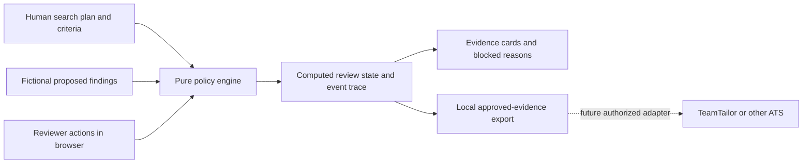
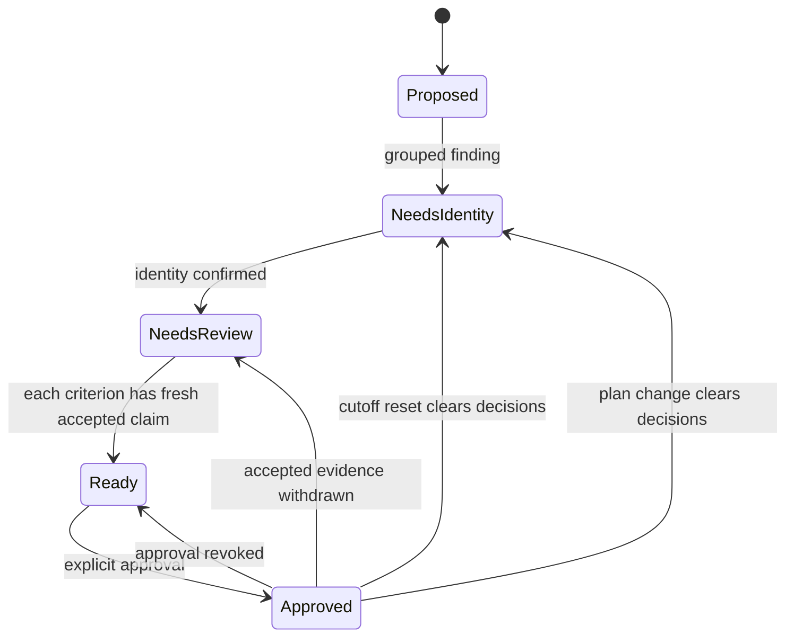
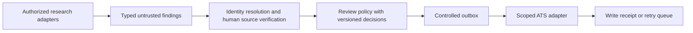

# Signal Desk architecture

Signal Desk demonstrates one recruiting operation: turning proposed research into source-by-source human review and a controlled local handoff. The [public Talent Engineer posting](https://aplayers.na.teamtailor.com/jobs/617015-talent-engineer-ai-automation-a-players) motivates the problem. The built-in fixture contains fictional people; this independent artifact is not an A-Players system.

## Decision boundary

Several observations about one apparent person may come from different research hypotheses. A name match is not identity proof; a source quotation is not verified evidence; accepting one claim does not validate every claim from a source. The design keeps five decisions separate:

1. **Plan:** What problem is this search for, which existing criteria are required, and which existing research channels participate?
2. **Intake:** Is a proposed record well formed and within the role's declared criteria?
3. **Identity:** Does a reviewer confirm that the grouped observations refer to one person?
4. **Evidence:** Has the reviewer accepted this particular claim, from this particular source, for this particular criterion? Is its observation date inside the chosen review window?
5. **Handoff:** Does every selected required criterion have accepted fresh evidence, with confirmed identity and explicit approval?

The browser interface makes those decisions inspectable. It does not rank candidates or decide suitability or hiring.

## Present layers and API

`src/engine.js` is the canonical browser policy engine, with no browser or network dependency. `src/app.js` renders its state, dispatches actions, and accepts local JSON project imports; `src/search-plan.js` renders plan controls, channel results, and required-criterion coverage; `src/style.css` owns presentation. The static app has no login, service, model call, or external provider. State lives in memory and disappears on reload. An export is a downloaded local JSON file. The existing Python `research_handoff.py` and JSON examples are an earlier offline reference; the browser neither calls Python nor shares its runtime.

The engine contract is `demoProject(scenario)` for a fictional project, `createSession(project)` for initial state, `transition(state, action)` for an immutable next state, `viewSession(state)` for a read model, and `exportHandoff(state)` for the approved local packet. The view exposes project, active plan, revision, candidates, hypotheses, criterion coverage, metrics, events, and export packet. The packet declares `signal-desk-handoff.v1`, `synthetic-local-demo`, and `self-attested, unauthenticated`; it also carries the project title, criteria, hypotheses, active plan, accepted required evidence, reasons, and event trail. These fields describe the artifact; they do not authenticate a reviewer or certify a source. The UI supports Ukrainian and English labels; language does not alter policy.

## Data and action contracts

| Object | Fields or meaning | Trust |
| --- | --- | --- |
| Project | `id`, `title`, optional `objective` (defaults to title), fixed replay date `asOf`, `cutoff`, available `criteria`, research `hypotheses`, `findings` | Built-in fictional fixture or user-supplied local JSON |
| Active search plan | Bilingual objective, selected required criterion IDs, selected existing hypothesis IDs, change reason | Human configuration; defaults to all criteria and channels |
| Finding | `id`, declared `personKey`, display `name`, `identityRef`, `hypothesisId`, source, criterion claims | Untrusted proposed research |
| Source | Reference, title, inspectable text, `observedAt` | Citation for human inspection, not verified truth |
| Claim | `criterionId`, quoted supporting text | Untrusted claim against one criterion |
| Review action | Evidence ID, accept/reject, reviewer, reason | In-session human assertion |
| Identity action | Person key, confirmed state, reviewer | In-session human assertion |
| Handoff action | Approve/revoke, person key, reviewer | Revocable in-session authorization |
| Cutoff action | New date; clears prior reviews, identity confirmations, approvals | Role policy change |
| Plan action | `setPlan` with objective, nonempty existing criterion and hypothesis selections, reason, reviewer; clears reviews, identity confirmations, approvals | Search-policy change |

An accepted observation is research evidence for a reviewer to consider, not proof that its content is true in the world. `observedAt` means when the observation was recorded. `asOf` is a supplied replay snapshot (2026-09-28 in the standard example); a finding dated after it is refused. Validation compares dates with this snapshot, not the computer's current clock. An observation date does not establish when the source last changed, current employment, consent, or candidate fit. A new cutoff resets review decisions rather than carrying approvals across a changed policy.

The local JSON importer accepts the same validated project shape and allows source references beginning with `synthetic://`; it does not fetch sources. A source includes the full inspectable text, and each claim's quote must appear in that text. This is a structural check, not external verification. The engine cannot prove that user-supplied text describes fictional people. The UI labels imported content as unverified fictionality and starts a fresh session with no reviews, identity confirmations, or approvals.

The plan can change the objective wording, require a subset of existing criteria, and activate a subset of existing fictional research channels. It does not parse natural language or search for new people. Active channels determine which observations and claims appear in the current review and handoff. Identity conflicts are checked against **all archived findings**, including inactive channels, so hiding one channel cannot turn a known ambiguous identity into a safe one. Every plan change records the reason and reviewer and invalidates prior reviews, identity confirmations, and approvals.

## State and invariants

The diagram is illustrative: identity can be confirmed before or after evidence review. Status is derived from the current project, active plan, and actions, never an independent permission flag. Export is fail closed when identity is unconfirmed, any **selected required** criterion lacks at least one accepted fresh claim from an active channel, or approval is missing. A pending or rejected alternative does not block a criterion already covered by another accepted fresh claim. Duplicate observations retain distinct source references; reviewing one evidence item never reviews another. Revocation, cutoff change, and plan change recompute the export immediately. The event trace explains in-session changes; it is not a durable audit log or proof of reviewer identity.

| Failure or change | Expected behavior |
| --- | --- |
| Malformed record, duplicate ID, unknown criterion, impossible date, or observation after supplied `asOf` | Reject intake with context; preserve the previous session on failed import |
| Conflicting names or identity references within a declared group | Block confirmation and handoff until the input conflict is resolved |
| One identity reference reused by different declared person keys | Block both groups; confirmation cannot resolve contradictory input |
| Plausible quotation, no review | Pending claim does not satisfy criterion |
| One accepted claim | Only its source-criterion evidence advances |
| One rejected claim with another accepted fresh claim for the same criterion | Accepted claim can still satisfy that criterion |
| Accepted observation before cutoff | Mark stale; does not satisfy criterion |
| Cutoff changed | Clear reviews, identity confirmations, approvals; recompute from new date |
| Search objective, required criteria, or active channels changed | Clear reviews, identity confirmations, approvals; recompute from new plan |
| Conflicting identity appears only in an inactive channel | Keep the identity hold from all archived findings |
| Approval or evidence acceptance revoked | Remove affected handoff entry |

The view reports each channel's active state, observations and unique people in the active plan, fresh accepted/rejected/pending claim counts, and a separate stale count. Archived availability is separate: an inactive channel has zero current review workload even if its fixture contains available observations. Handoff contribution counts approved people with accepted fresh **required** evidence from that channel. One person can contribute to several channels, so channel counts must never be summed as independent hiring wins. The coverage matrix shows only selected required criteria and counts unique active people with at least one fresh proposed claim versus at least one fresh accepted claim. These are review-state counts, not sourcing effectiveness or labor outcomes.

Focused engine tests should exercise each invariant without the browser. A UI smoke check should then verify that the visible explanation and exported packet agree after each action. The old Python tests prove only the old Python contract.

The view also exposes `session.exhausted`, `eventCount`, and `eventLimit`. At 2000 events, the session becomes read-only: historical statuses remain visible, `exportPacket` is null, and `exportHandoff` refuses export independently of the UI. A fresh session must be created to resume decisions; existing reviews and approvals do not carry over.

## Why a static state machine

Three options were considered: a presentation-only dashboard, this deterministic state machine, and a backend with provider integrations. A dashboard cannot show what changes when a reviewer rejects one claim or moves the cutoff. A backend requires accounts, secrets, source permissions, retention rules, and provider contracts before the workflow has been observed. The browser state machine is the smallest artifact that lets an interviewer challenge the policy live. It is a design probe, not a claim that the team's bottleneck is already known.

## Boundary for a real pilot

After permission, observation, and a real scorecard, a production path could be:

These adapters **do not exist in this prototype**. They would need permitted source access, identity and reviewer authentication, role-specific data rules, retention and deletion, field mapping, least-privilege ATS credentials, idempotency keys, retries, reconciliation against the ATS as source of truth, and correction of an erroneous write. A versioned decision should bind role criteria, evidence, cutoff, and reviewer; otherwise an old approval can appear valid after policy changes. The outbox would separate a human decision from a network write and permit safe retry without duplicate ATS records.

An internal knowledge base may inform a human scorecard only with explicit access and an agreed read scope. Its schema, permissions, and contents are unknown here. The first pilot decision is where the team really loses time: discovery, source verification, identity resolution, or handoff. See the [pilot plan](pilot-plan.uk.md) and [limits](limits.md).
